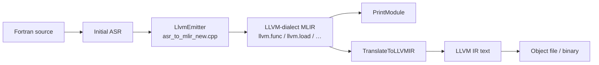

# lfortran_mlir

LFortran’s **mlir-new** backend: compile Fortran via **Initial ASR → LLVM-dialect MLIR → LLVM IR → object code**, using the vendored [certik/mlir](https://github.com/certik/mlir) C API.

---

## Current paths

```
lfortran/                           ★ primary git root (use this)
│   ├── CMakeLists.txt                  LFortran + WITH_MLIR / WITH_LLVM options
│   ├── build0.sh / build1.sh           configure / build helpers
│   └── src/
│       ├── bin/lfortran.cpp            CLI, backend selection, dump flags
│       ├── libasr/codegen/
│       │   ├── asr_to_mlir_new.{h,cpp} ★ mlir-new pipeline driver (LlvmEmitter)
│       │   └── evaluator.{h,cpp}       MLIRModule snapshots + llvm::Module parse
│       ├── lfortran/fortran_evaluator.cpp
│       │                               get_mlir_new() — Initial ASR only
│       └── mlir/
│           ├── CMakeLists.txt          lfortran_corec, pipeline, upstream_impl
│           ├── upstream/               git submodule → certik/mlir @ 47c3691
│           └── lfortran/               ★ LFortran-owned MLIR overrides
│               ├── mlir_new_backend.{c,h}
│               ├── mlir_lfortran_hooks.{c,h}
│               ├── mlir_lower_to_llvm_lfortran.c
│               ├── mlir_translate_to_llvm_ir_lfortran.c
│               ├── mlir_upstream_api_rename.h
│               └── corec/              hosted platform + buddy allocator
│
```

**Submodule (required once per clone):**

```bash
cd lfortran
git submodule update --init --recursive src/mlir/upstream
```

Upstream is pinned at vanilla **certik/mlir `47c3691`** (no LFortran-specific edits inside the submodule).

---

## Pipeline



| Stage | What it is | Dump flag |
|-------|------------|-----------|
| Initial ASR | Semantic ASR after `ast_to_asr`, **before default ASR passes** | `--show-asr` |
| LLVM-dialect MLIR | Direct emission from ASR via certik/mlir C API | `--show-mlir-llvm-dialect` |
| LLVM IR | Text from native or upstream translate | `--show-mlir` or `--show-llvm-from-mlir` |
| Object file | Parsed `llvm::Module` → `.o` | `-c` with `--backend=mlir-new-*` |

**Two print/translate backends** (selected on the CLI, not via environment variables):

| Backend | CLI | Core API | Print / translate |
|---------|-----|----------|-------------------|
| Native (default) | `--backend=mlir-new-native` or `--backend=mlir-new` | `mlir_api_impl.c` | `mlir_lower_to_llvm_lfortran.c`, `mlir_translate_to_llvm_ir_lfortran.c` |
| Upstream | `--backend=mlir-new-upstream` | `mlir_api_impl_upstream.cpp` (symbols prefixed `MLIR_Upstream_*`) | upstream MLIR pass pipeline + `MLIR_TranslateModuleToLLVMIRUpstream` |

Both backends share the same **LlvmEmitter** in `asr_to_mlir_new.cpp`; only the vtable in `mlir_new_backend.c` differs for print/translate.

### Call chain

```
lfortran main
  └─ handle_mlir() / compile path          [src/bin/lfortran.cpp]
       └─ FortranEvaluator::get_mlir_new()  [fortran_evaluator.cpp]
            └─ asr_to_mlir_new()            [asr_to_mlir_new.cpp]
                 ├─ platform_init() once    [corec buddy heap]
                 ├─ LlvmEmitter (ASR walk)  → MLIR_CreateOp / llvm.* ops
                 ├─ api->PrintModule()       [native or upstream vtable]
                 └─ api->TranslateToLLVMIR()
            └─ MLIRModule::mlir_to_llvm()    [evaluator.cpp — parse .ll text]
```

---

## Build and compilation

### Prerequisites

- Linux (tested)
- Conda environment **`mlir19`** with LLVM **19** + MLIR (WebAssembly target must be in the built LLVM)
- Ninja, C/C++ toolchain

### Configure and build

All commands from **`lfortran/`**:

```bash

./build0.sh
cmake . -GNinja \
  -DWITH_LLVM=yes \
  -DWITH_MLIR=yes \
  -DCMAKE_PREFIX_PATH="$CONDA_PREFIX"
./build1.sh
```

Add the compiler to `PATH`:

```bash
export PATH="$(pwd)/src/bin:$PATH"
```

| CMake flag | Required for mlir-new |
|------------|------------------------|
| `-DWITH_LLVM=yes` | Yes — LLVM IR parse + object emission |
| `-DWITH_MLIR=yes` | Yes — links `lfortran_mlir_c_api` (pipeline + upstream_impl) |

**WebAssembly LLVM components:** when `WITH_MLIR=yes`, the build always links `webassembly*` LLVM libs so upstream wasm entry points in `mlir_api_impl_upstream.cpp` resolve on host builds (no local stubs).

**Optional:** `-DLFORTRAN_MLIR_WASM_LOWERING=yes` adds the tinyc native wasm pipeline (`lfortran_mlir_wasm_lowering`); separate from host mlir-new object emission.

---

## Usage

```bash
# Full compile and run (native backend)
lfortran a.f90 --backend=mlir-new-native

# Alias for native
lfortran a.f90 --backend=mlir-new

# Upstream MLIR passes for print/translate
lfortran a.f90 --backend=mlir-new-upstream

# Pipeline snapshots
lfortran a.f90 --backend=mlir-new-native --show-mlir-llvm-dialect   # LLVM-dialect MLIR
lfortran a.f90 --backend=mlir-new-native --show-mlir                 # LLVM IR text

# Compare native vs upstream translate
lfortran a.f90 --backend=mlir-new-native --show-mlir
lfortran a.f90 --backend=mlir-new-upstream --show-mlir
```

Show flags require `WITH_MLIR=yes` at compile time. `--show-mlir-llvm-dialect` alone selects the mlir-new-native pipeline even without an explicit `--backend`.

**Note:** `--show-llvm` uses the **classic LLVM backend** (`asr_to_llvm`), not mlir-new.

---

## New files (`mlir8-llvm-lowering`)

Rough map of LFortran-owned code added for direct ASR → LLVM-dialect emission and dual-backend linking.

### Codegen (C++)

| File | Role |
|------|------|
| [`src/libasr/codegen/asr_to_mlir_new.h`](lfortran/src/libasr/codegen/asr_to_mlir_new.h) | Declares `asr_to_mlir_new()` and takes `MlirNewBackendKind`. |
| [`src/libasr/codegen/asr_to_mlir_new.cpp`](lfortran/src/libasr/codegen/asr_to_mlir_new.cpp) | **`LlvmEmitter`**: walks Initial ASR and builds `llvm.*` MLIR ops directly via the C API vtable; calls `PrintModule` + `TranslateToLLVMIR`; returns `MLIRModule` with LLVM IR + optional dialect snapshot. |
| [`src/libasr/codegen/evaluator.h`](lfortran/src/libasr/codegen/evaluator.h) / [`.cpp`](lfortran/src/libasr/codegen/evaluator.cpp) | `MLIRModule` holds `llvm_ir_from_mlir_api` and `mlir_llvm_dialect_text`; `mlir_to_llvm()` parses IR text for `-c`. |
| [`src/lfortran/fortran_evaluator.cpp`](lfortran/src/lfortran/fortran_evaluator.cpp) | `get_mlir_new()` — passes Initial ASR (skips default optimization passes). |
| [`src/bin/lfortran.cpp`](lfortran/src/bin/lfortran.cpp) | Wires `--backend=mlir-new-native\|mlir-new-upstream`, `handle_mlir()`, object emission. |

### Backend dispatch (C)

| File | Role |
|------|------|
| [`src/mlir/lfortran/mlir_new_backend.h`](lfortran/src/mlir/lfortran/mlir_new_backend.h) | `MlirNewBackendKind`, `MlirNewApi` vtable (create/print/translate function pointers), `mlir_new_api_for()`. |
| [`src/mlir/lfortran/mlir_new_backend.c`](lfortran/src/mlir/lfortran/mlir_new_backend.c) | Fills **`lfortran_mlir_new_native_api`** (native C API symbols) and **`lfortran_mlir_new_upstream_api`** (prefixed `MLIR_Upstream_*` symbols). Lets both backends link into one binary. |

**How it works:** `asr_to_mlir_new.cpp` only calls through `const MlirNewApi *api = mlir_new_api_for(backend)`. Emission uses the same op-creation entry points; print/translate diverge per backend.

### LFortran lowering / translate hooks (C)

| File | Role |
|------|------|
| [`src/mlir/lfortran/mlir_lfortran_hooks.h`](lfortran/src/mlir/lfortran/mlir_lfortran_hooks.h) | Hook API: `MLIR_LFortranTryLowerOp`, `mlir_lower_vector_print_native`, GEP index printing, block label policy. |
| [`src/mlir/lfortran/mlir_lfortran_hooks.c`](lfortran/src/mlir/lfortran/mlir_lfortran_hooks.c) | Implementations (e.g. rewrite `vector.print` → libc `printf`). |
| [`src/mlir/lfortran/mlir_lower_to_llvm_lfortran.c`](lfortran/src/mlir/lfortran/mlir_lower_to_llvm_lfortran.c) | Fork of upstream `mlir_lower_to_llvm.c` with **`MLIR_LOWER_*` macro injection points** calling LFortran hooks. Supplies native `MLIR_LowerToLLVMDialect`. Refresh body from upstream when certik/mlir changes. |
| [`src/mlir/lfortran/mlir_translate_to_llvm_ir_lfortran.c`](lfortran/src/mlir/lfortran/mlir_translate_to_llvm_ir_lfortran.c) | Fork of upstream `mlir_translate_to_llvm_ir.c` with **`MLIR_LLVM_IR_*` hooks** for GEP index types and block labels. Supplies native `MLIR_TranslateModuleToLLVMIR`. |

**How it works:** Both files are plain C using only `mlir_api.h` (no upstream MLIR C++ headers). They are linked into **`lfortran_mlir_pipeline`** and used by the native vtable. Upstream backend uses `mlir_api_impl_upstream.cpp` instead for print/translate, but can still share the same hook ideas via upstream passes where applicable.

### Dual-backend linking (C / C++)

| File | Role |
|------|------|
| [`src/mlir/lfortran/mlir_upstream_api_rename.h`](lfortran/src/mlir/lfortran/mlir_upstream_api_rename.h) | `#define MLIR_CreateOp MLIR_Upstream_CreateOp` … — renames every shared C API symbol in the upstream C++ TU so native and upstream impls coexist. |
| [`src/mlir/upstream/mlir_api_impl_upstream.cpp`](lfortran/src/mlir/upstream/mlir_api_impl_upstream.cpp) | Upstream MLIR C++ implementation; compiled as **`lfortran_mlir_upstream_impl`** with the rename header forced via `-include`. |

**How it works:** CMake builds two static libraries — `lfortran_mlir_pipeline` (native + dispatch) and `lfortran_mlir_upstream_impl` (prefixed upstream) — and wraps them in a linker group (`--start-group`) on Linux to resolve the circular reference between dispatch and upstream symbols.

### Build wiring

| File | Role |
|------|------|
| [`src/mlir/CMakeLists.txt`](lfortran/src/mlir/CMakeLists.txt) | `lfortran_corec`, `lfortran_mlir_pipeline`, `lfortran_mlir_upstream_impl`, optional `lfortran_mlir_wasm_lowering`, interface target `lfortran_mlir_c_api`. |
| [`cmake/LFortranMLIRLink.cmake`](lfortran/cmake/LFortranMLIRLink.cmake) | Discovers and links static `libMLIR*.a` archives. |
| [`CMakeLists.txt`](lfortran/CMakeLists.txt) | `WITH_MLIR`, WebAssembly LLVM component list when MLIR is enabled. |

### Hosted corec platform

| Path | Role |
|------|------|
| [`src/mlir/lfortran/corec/platform/platform_*.c`](lfortran/src/mlir/lfortran/corec/platform/) | **`PLATFORM_HOSTED`**: buddy heap via libc `mmap`, no `_start`, no weak `memcpy`/`memset` that fight glibc. |
| [`src/mlir/lfortran/corec/base/buddy.c`](lfortran/src/mlir/lfortran/corec/base/buddy.c) | Idempotent `buddy_init` for repeated `platform_init()`. |

`asr_to_mlir_new` calls `platform_init(0, nullptr)` once via `std::call_once` before any MLIR C API use.

---

## CMake targets (summary)

| Target | Contents |
|--------|----------|
| `lfortran_corec` | Buddy allocator + hosted platform |
| `lfortran_mlir_pipeline` | Native C API, LFortran lower/translate forks, hooks, backend dispatch |
| `lfortran_mlir_upstream_impl` | Upstream C++ API with symbol prefix |
| `lfortran_mlir_c_api` | INTERFACE — links pipeline + upstream_impl (linker group on Linux) |
| `lfortran_mlir_wasm_lowering` | Optional tinyc wasm pipeline (`LFORTRAN_MLIR_WASM_LOWERING`) |

`src/libasr` links against `lfortran_mlir_c_api` when `WITH_MLIR=yes`.

---

## Design notes

### Why direct LLVM-dialect emission?

The mlir8 path emits **`llvm.*` ops straight from ASR** (`LlvmEmitter`). That keeps the first working backend smaller while still using the certik/mlir C API and the same downstream print/translate split.

### Why two backends?

- **Native** — C-only lower/translate with LFortran hook injection; no MLIR C++ headers in the hot path.
- **Upstream** — LLVM 19 MLIR pass pipeline inside certik/mlir; useful for comparing behavior against tinyc/upstream.

Both are linked simultaneously; the CLI picks which vtable `asr_to_mlir_new` uses.

### Upstream submodule policy

`src/mlir/upstream` tracks **certik/mlir**. LFortran-specific behavior lives under `src/mlir/lfortran/` (hooks, forks, rename header, dispatch). Do not add LFortran API declarations or ifdefs inside the submodule.

---
