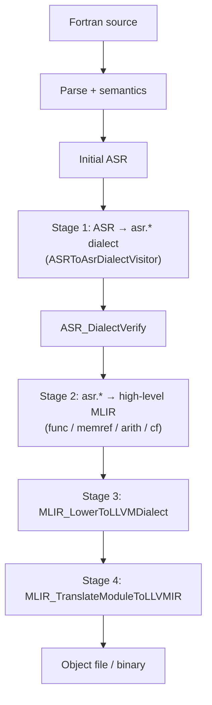

# LFortran — mlir-new backend

GSOC fork focused on LFortran’s **mlir-new** backend: compile Fortran via **Initial ASR → ASR MLIR dialect → high-level MLIR → LLVM dialect → LLVM IR → object code**, using the vendored [certik/mlir](https://github.com/certik/mlir) C API.

Upstream LFortran docs: https://docs.lfortran.org/

## Repository layout

```
./
├── README.md                 ← this document
├── src/libasr/codegen/       ASR → mlir-new pipeline (C++)
├── src/mlir/generated/       ASR dialect headers (from ASR.asdl)
├── src/mlir/lfortran/        ASR dialect runtime + MLIR C API overrides
├── src/mlir/upstream/        certik/mlir submodule
└── AGENTS.md                 agent bootstrap + Clarity workflow
```

---

## End-to-end pipeline (`--backend=mlir-new`)



| Stage | What it is | Dump flag | Stored in `MLIRModule` |
|-------|------------|-----------|------------------------|
| Initial ASR | C++ ASR tree after semantics, **before default ASR passes** | `--show-asr` (classic path) | — |
| **ASR MLIR dialect** | ~246 `asr.*` ops mirroring ASR nodes | **`--show-mlir-asr-dialect`** | `mlir_asr_dialect_text` |
| High-level MLIR | `func`, `memref`, `arith`, `cf`, `vector.print`, … | `--show-mlir` / `--show-mlir-high-dialect` | `mlir_high_dialect_str` |
| LLVM-dialect MLIR | `llvm.*` ops | `--show-mlir-llvm-dialect` | `mlir_llvm_dialect_text` |
| LLVM IR | `.ll` text | `--show-llvm-from-mlir` | `llvm_ir_from_mlir_api` |
| Object file | `.o` | `-c` | parsed `llvm::Module` |

**Orchestrator:** [`src/libasr/codegen/asr_to_mlir_new.cpp`](src/libasr/codegen/asr_to_mlir_new.cpp) runs stages in order and stops early when a debug dump target is selected (`MlirNewPipelineTarget`).

---

## Logical flow (call chain)

```
lfortran main
  └─ FortranEvaluator::get_mlir_new()          [fortran_evaluator.cpp]
       └─ asr_to_mlir_new()                   [asr_to_mlir_new.cpp]
            ├─ platform_init() once           [corec buddy heap]
            ├─ ASRToAsrDialectVisitor         [asr_to_asr_dialect.cpp]
            │    └─ ASR_Create*Op()           [generated/asr_dialect_api_generated.h]
            │         └─ ASR_DialectCreateOp  [asr_dialect_api_native.c]
            ├─ ASR_DialectVerify()            [asr_dialect_api_native.c]
            ├─ ASR_DialectPrint()               [asr_dialect_pretty_print.c]
            ├─ ASR_DialectLowerToHighMLIR()     [asr_dialect_api.c → handlers]
            │    └─ ASR_DialectLowerOneOp()     [generated/asr_dialect_lowering_dispatch.h]
            │         └─ ASR_Lower*()           [asr_dialect_lowering_handlers.c]
            ├─ MLIR_LowerToLLVMDialect*()       [mlir_lower_to_llvm.c or upstream]
            └─ MLIR_TranslateModuleToLLVMIR*()  [mlir_translate_to_llvm_ir.c or upstream]
       └─ MLIRModule::mlir_to_llvm()           [evaluator.cpp — parse .ll into llvm::Module]
```

**Entry from CLI:** `handle_mlir()` in [`src/bin/lfortran.cpp`](src/bin/lfortran.cpp) selects `MlirNewPipelineTarget` from the show flags, then prints the matching snapshot or writes an object file.

---

## New and changed files

### Codegen orchestration (C++)

| File | Role |
|------|------|
| [`src/libasr/codegen/asr_to_mlir_new.h`](src/libasr/codegen/asr_to_mlir_new.h) | Declares `asr_to_mlir_new()` and `MlirNewPipelineTarget` (how far the pipeline runs). |
| [`src/libasr/codegen/asr_to_mlir_new.cpp`](src/libasr/codegen/asr_to_mlir_new.cpp) | Pipeline driver: emit ASR dialect → verify → print → lower to high MLIR → LLVM dialect → LLVM IR. |
| [`src/libasr/codegen/asr_to_asr_dialect.h`](src/libasr/codegen/asr_to_asr_dialect.h) | `ASRToAsrDialectVisitor`: walks Initial ASR and builds `asr.*` ops; scope regions (`asr.symtab`, `asr.body`, …). |
| [`src/libasr/codegen/asr_to_asr_dialect.cpp`](src/libasr/codegen/asr_to_asr_dialect.cpp) | Visitor implementations (hand-written + **generated** `visit_*` stubs from ASR.asdl). |
| [`src/libasr/codegen/evaluator.h`](src/libasr/codegen/evaluator.h) / [`.cpp`](src/libasr/codegen/evaluator.cpp) | `MLIRModule` holds text snapshots for each stage; `mlir_to_llvm()` parses IR text for object emission. |
| [`src/lfortran/fortran_evaluator.cpp`](src/lfortran/fortran_evaluator.cpp) | `get_mlir_new()` — uses **Initial ASR only** (skips default ASR optimization passes). |

### ASR dialect generator (Python)

| File | Role |
|------|------|
| [`src/libasr/asdl_to_asr_dialect.py`](src/libasr/asdl_to_asr_dialect.py) | Reads **`ASR.asdl`** and emits all generated artifacts. Run automatically at build time via CMake. |
| [`src/libasr/ASR.asdl`](src/libasr/ASR.asdl) | **Single source of truth** for ASR node shapes; drives op count, fields, and enum names. |

**Regenerate manually** (from repository root):

```bash
python src/libasr/asdl_to_asr_dialect.py \
  --asdl src/libasr/ASR.asdl \
  --out-mlir-dir src/mlir/generated \
  --out-codegen-dir src/libasr/codegen
```

**Check committed output matches ASR.asdl:**

```bash
python src/libasr/asdl_to_asr_dialect.py --check \
  --asdl src/libasr/ASR.asdl \
  --out-mlir-dir src/mlir/generated \
  --out-codegen-dir src/libasr/codegen
```

### Generated headers (`src/mlir/generated/`)

All four are produced by `asdl_to_asr_dialect.py` — **do not edit by hand**.

| File | Purpose |
|------|---------|
| **`asr_dialect_schema.h`** | Dialect specification: `ASR_DialectOpKind` enum (~246 ops), per-op field descriptors, master `ASR_DIALECT_SCHEMA[]` table. Used by create/verify/print to walk ops generically. |
| **`asr_dialect_api_generated.h`** | Typed builders `ASR_CreateVariableOp(...)`, `ASR_CreateDoLoopOp(...)`, etc. — one per ASR constructor. The visitor calls these instead of assembling field arrays by hand. |
| **`asr_dialect_lowering_dispatch.h`** | Header-only `ASR_DialectLowerOneOp()` switch: maps op kind → `ASR_Lower*()` handler (only ops in `LOWERED_OPS` have handlers today). |
| **`asr_dialect_enum_print.h`** | Name tables for ASR simple enums (`intent`, `access`, `binop`, …) so pretty-print shows `"inout"` instead of `2`. |

The generator also updates marked sections in `asr_to_asr_dialect.h` / `.cpp` (visitor declarations and default `visit_*` bodies).

### Hand-written ASR dialect runtime (`src/mlir/lfortran/`)

| File | Role |
|------|------|
| [`asr_dialect_api.h`](src/mlir/lfortran/asr_dialect_api.h) | Public C API: `ASR_DialectCreateOp`, `ASR_DialectVerify`, `ASR_DialectLowerToHighMLIR`, `ASR_DialectPrint`. |
| [`asr_dialect_api.c`](src/mlir/lfortran/asr_dialect_api.c) | Facade: schema lookup, delegates create/verify/print to native or upstream backend. |
| [`asr_dialect_api_native.c`](src/mlir/lfortran/asr_dialect_api_native.c) | **Native op creation:** scalar fields → `asr.*` MLIR attributes; child op refs → module side storage. Verification walks the schema. |
| [`asr_dialect_api_upstream.cpp`](src/mlir/lfortran/asr_dialect_api_upstream.cpp) | Optional upstream-MLIR-backed dialect path (for future parity / testing). |
| [`asr_dialect_module_storage.c`](src/mlir/lfortran/asr_dialect_module_storage.c) / [`.h`](src/mlir/lfortran/asr_dialect_module_storage.h) | Context-owned side table for child op pointers, statement bodies, op sequences, and type metadata — **not** stored as integer pointer attributes on ops. |
| [`asr_dialect_fields.h`](src/mlir/lfortran/asr_dialect_fields.h) | Read helpers: `asr_get_field_str`, `asr_get_field_op`, `asr_get_field_op_seq`, etc. |
| [`asr_dialect_pretty_print.c`](src/mlir/lfortran/asr_dialect_pretty_print.c) | Textual dump of `asr.*` IR (`ASR_DialectPrint`); uses schema + enum_print for readable output. |
| [`asr_dialect_lowering_handlers.c`](src/mlir/lfortran/asr_dialect_lowering_handlers.c) | Semantic lowering: ASR dialect ops → high-level MLIR (`memref.alloca`, `arith.addi`, `cf.br`, …). Hand-written per op family; dispatch is generated. |

### MLIR C API and downstream lowering (`src/mlir/lfortran/` + `upstream/`)

| File | Role |
|------|------|
| `mlir_api.h` | C API for creating high-level MLIR, lowering, translation, print. |
| `mlir_lower_to_llvm.c` | Native high-level → LLVM dialect (+ LFortran memref / `vector.print` → `printf`). |
| `mlir_translate_to_llvm_ir.c` | LLVM-dialect MLIR → LLVM IR text. |
| `mlir_lift_cf_to_scf.c` | CF → SCF lift (wasm / upstream paths). |
| `mlir_api_impl_upstream.cpp` | Full upstream MLIR pass pipeline when `USE_MLIR_Upstream=1`. |
| `corec/platform/platform_*.c` | Hosted platform (`PLATFORM_HOSTED`) for buddy allocator used by the C API. |

**CMake:** [`src/mlir/CMakeLists.txt`](src/mlir/CMakeLists.txt) builds:

- `lfortran_corec` — allocator / platform
- `lfortran_mlir_c_api` — generic MLIR C API
- `lfortran_asr_dialect` — ASR dialect + lowering (depends on generated headers)
- `generate_asr_dialect` — runs Python generator before compile

---

## Design decisions (why things are this way)

### Why an ASR MLIR dialect instead of emitting high-level MLIR directly?

**Design A:** one ASR constructor → one `asr.*` operation. The dialect is a **structured, inspectable IR layer** that:

- Mirrors ASR closely, so debugging starts at a familiar tree shape.
- Separates **emission** (visitor + generated builders) from **lowering** (handlers), so each stage can evolve independently.
- Allows `--show-mlir-asr-dialect` to dump stage 1 without running later passes.

Lowering to `func`/`memref`/`arith` is intentionally a **second pass** (`ASR_DialectLowerToHighMLIR`), implemented incrementally via `LOWERED_OPS` in the generator.

### Why generate from `ASR.asdl` instead of hand-maintaining ops or MLIR TableGen ODS?

ASR already has a formal schema in ASDL. The generator keeps **~246 op definitions**, field kinds, enum strings, visitor stubs, and dispatch switches **in sync** when ASR evolves. The project uses the **vendored certik/mlir C API** (corec), not upstream C++ MLIR builders — TableGen ODS would not plug into that stack cleanly.

### Why module side storage for child ops and bodies?

Child expressions, statement bodies, and op sequences are stored in **`ASR_ModuleStorage*`** (context-owned tables), not as pointer-shaped integer attributes on MLIR ops. That keeps default MLIR dumps stable, avoids fake pointer attrs, and gives verify/print/lowering a single place to resolve `"value"`, `"body"`, `"args"`, etc.

Scalar metadata (`intent`, `name`, `type`, …) still lives as normal **`asr.<field>`** attributes on each op.

### Why Initial ASR only (no default ASR passes)?

`get_mlir_new()` deliberately skips the pass pipeline used by the LLVM backend. The mlir-new path is being built against the **semantic ASR** produced right after `ast_to_asr`, before transforms that rewrite the tree for the legacy codegen. That makes dumps match what the ASR dialect emitter expects and avoids coupling to pass ordering while the new backend is still growing.

### Why two MLIR lowering backends (`USE_MLIR_Upstream`)?

| Mode | When | What |
|------|------|------|
| Native (default) | `USE_MLIR_Upstream` unset or not `1` | C implementations in `mlir_lower_to_llvm.c` / `mlir_translate_to_llvm_ir.c` |
| Upstream | `USE_MLIR_Upstream=1` | LLVM 19 MLIR pass pipeline in `mlir_api_impl_upstream.cpp` |

Both expose the same C API handles. Upstream is useful for comparing lowering behavior; native keeps the hosted LFortran path self-contained and supports custom hooks (e.g. `vector.print` → `printf`, `memref<1xi32>` locals).

### Why `memref<1xi32>` for scalar integers?

Rank-0 `memref<i32>` without indices produced invalid LLVM IR after MemRef lowering. Scalars use **`memref<1xi32>`** with **`index.constant 0`** for load/store. This is a deliberate lowering choice in the ASR-dialect → high-MLIR handlers.

### Why is lowering dispatch a header-only generated file?

`asr_dialect_lowering_dispatch.h` holds a `static inline` switch so there is no separate `.c` translation unit to link. Handlers remain in `asr_dialect_lowering_handlers.c`; only the routing table is generated from `LOWERED_OPS`.

### How does this differ from `--backend=mlir` (classic)?

| | `mlir` (classic) | `mlir-new` |
|--|------------------|------------|
| ASR input | Final ASR (after passes) | Initial ASR |
| IR construction | C++ MLIR C++ builder (`asr_to_mlir.cpp`) | C API + ASR dialect |
| Stages | Direct to MLIR module | ASR dialect → high MLIR → LLVM dialect → IR |

---

## Build

### Prerequisites

- Linux (tested)
- Conda environment **`mlir19`** with LLVM **19** + MLIR
- Ninja, C/C++ toolchain, Python 3 (for ASR dialect generation)

Initialize MLIR submodule (first clone):

```bash
git submodule update --init --recursive src/mlir/upstream
```

### Configure and build

All commands from the **repository root**:

```bash
conda activate mlir19

# First time or after CMake cache corruption:
rm -rf CMakeCache.txt CMakeFiles/
rm -rf src/runtime/CMakeCache.txt src/runtime/CMakeFiles/ src/runtime/build.ninja

./build0.sh
cmake . -GNinja \
  -DWITH_LLVM=yes \
  -DWITH_MLIR=yes \
  -DCMAKE_PREFIX_PATH="$CONDA_PREFIX"
./build1.sh
```

Add the compiler to `PATH`:

```bash
export PATH="$(pwd)/src/bin:$PATH"
```

| CMake flag | Required for mlir-new |
|------------|------------------------|
| `-DWITH_LLVM=yes` | Yes — LLVM IR parse + object emission |
| `-DWITH_MLIR=yes` | Yes — `lfortran_mlir_c_api` + `lfortran_asr_dialect` |

If you previously built another LFortran tree in the same checkout, delete **`src/runtime/CMakeCache.txt`** before rebuilding.

### Environment variables

| Variable | Effect |
|----------|--------|
| `USE_MLIR_Upstream=1` | Upstream MLIR passes + `MLIR_TranslateModuleToLLVMIRUpstream` |
| unset / not `1` | Native C lowering (`mlir_lower_to_llvm.c`) + `MLIR_TranslateModuleToLLVMIR` |

---

## Usage

```bash
# Full compile and run
lfortran program.f90 --backend=mlir-new

# Compile to object
lfortran -c program.f90 -o program.o --backend=mlir-new

# Pipeline snapshots (each flag stops at that stage)
lfortran program.f90 --backend=mlir-new --show-mlir-asr-dialect   # stage 1: asr.*
lfortran program.f90 --backend=mlir-new --show-mlir-high-dialect  # stage 2: func/memref/arith
lfortran program.f90 --backend=mlir-new --show-mlir               # same as high-dialect for mlir-new
lfortran program.f90 --backend=mlir-new --show-mlir-llvm-dialect  # stage 3: llvm.*
lfortran program.f90 --backend=mlir-new --show-llvm-from-mlir     # stage 4: LLVM IR text

# Compare native vs upstream lowering
USE_MLIR_Upstream=0 lfortran program.f90 --backend=mlir-new --show-llvm-from-mlir
USE_MLIR_Upstream=1 lfortran program.f90 --backend=mlir-new --show-llvm-from-mlir
```

Show flags imply the mlir-new pipeline even if `--backend` defaults to `llvm`. Use `--backend=mlir-new` explicitly for `-c` / object emission.

**Note:** `--show-llvm` uses the **classic LLVM backend** (`asr_to_llvm`), not the mlir-new translation path.

---

## Lowering coverage (incremental)

Emission covers **all ASR nodes** as `asr.*` ops (via generated builders). **Lowering to high-level MLIR** is implemented only for ops listed in `LOWERED_OPS` inside `asdl_to_asr_dialect.py` (today: integers, logicals, basic arrays, loops, print/write, assignment, program/function scaffolding, etc.).

Representative lowered features:

| ASR / dialect | High-level MLIR (today) |
|---------------|-------------------------|
| `asr.variable` | `memref.alloca` (`memref<1xi32>` or `memref<Nxi32>`) |
| `asr.assign` | `memref.store` |
| `asr.var` / `asr.array_item` | `memref.load` |
| Integer binops / compares | `arith.addi`, `cmpi`, … |
| `asr.do_loop` | `cf.br`, `cf.cond_br` |
| `asr.print` | `vector.print` → lowered to `printf` |

Not yet lowered: most reals, user functions beyond scaffolding, rank > 1 arrays in many paths, most I/O intrinsics, most symbols. Unlowered ops hit `ASR_LowerUnsupported` unless `--show-mlir-asr-dialect` stops the pipeline early.

---

## Git commit history (mlir-new + ASR dialect)

Branch **`mlir6`**. Use `git log` or `clarity show -c HEAD~13..HEAD` to inspect.

| Commit | Subject |
|--------|---------|
| (this branch) | docs: mlir-new backend README |
| `c7eeb7832` | docs: Clarity workflow in AGENTS.md |
| `93bb94ee0` | mlir: bump certik/mlir upstream submodule |
| `42798c0d2` | mlir: generalize native memref lowering for rank-1 i32 arrays |
| `e85e21c78` | cli: `--show-mlir-asr-dialect` and stage-aware dumps |
| `1d53059f8` | lfortran: `MlirNewPipelineTarget` in `get_mlir_new` |
| `d3e8857c2` | codegen: staged ASR dialect pipeline in `asr_to_mlir_new` |
| `5652e8cc2` | cmake: `lfortran_asr_dialect` library |
| `cd93f3e98` | codegen: `ASRToAsrDialectVisitor` |
| `a12780b9d` | mlir: ASR dialect native runtime |
| `15fa6b4f9` | mlir: generated ASR dialect headers |
| `ab3217060` | asr: `asdl_to_asr_dialect.py` generator |
| `01c63150d` | corec: platform shims + int64 `int_to_string` |
| `13665f3b5` | cli: initial mlir-new backend and dump flags |
| `f468790fe` | impl: first mlir-new pipeline (Initial ASR → LLVM IR) |
| `3059d4abc` | cmake: certik/mlir submodule + MLIR C API build |
| `f690432be` | cmake: wire MLIR-new into LFortran build |

### Files introduced by the ASR dialect stack

**Generator:** `src/libasr/asdl_to_asr_dialect.py`

**Generated (review/check in):** `src/mlir/generated/asr_dialect_{schema,api_generated,lowering_dispatch,enum_print}.h`

**Visitor:** `src/libasr/codegen/asr_to_asr_dialect.{h,cpp}`

**Dialect runtime:** `src/mlir/lfortran/asr_dialect_*.{h,c,cpp}` (api, native, storage, fields, pretty_print, lowering_handlers)

**Pipeline integration:** updates to `asr_to_mlir_new.{h,cpp}`, `evaluator.{h,cpp}`, `fortran_evaluator.{h,cpp}`, CLI sources, CMakeLists.

---

## Platform / corec fixes

The vendored MLIR C API depends on **corec** (buddy allocator + platform syscalls). LFortran runs as a **hosted** binary (linked with glibc), not freestanding WASM — so platform code lives under `src/mlir/lfortran/corec/` as LFortran-specific overrides (upstream bare-metal copies stay in `src/mlir/upstream/`).

### Introduced in commit `3059d4abc` (hosted platform layer)

| Fix | Why |
|-----|-----|
| **`PLATFORM_HOSTED` + `PLATFORM_SKIP_ENTRY`** on `lfortran_corec` (CMake) | LFortran provides `main()`; corec must not own `_start`. Allocator still needs one-time setup via `platform_init()`. |
| **Hosted heap: libc `mmap` / `mprotect`** in `platform_linux.c` | When `PLATFORM_HOSTED` is set, buddy heap growth uses glibc syscalls instead of raw `syscall(SYS_MMAP, …)` — safer inside a normal Linux executable linked with libc. |
| **Skip weak `memcpy` / `memset` when hosted** (`#if !defined(PLATFORM_HOSTED)`) | Freestanding builds need weak byte-loop shims for `-nostdlib` links. In a glibc-hosted binary, defining weak `memcpy`/`memset` can fight **IFUNC / GOT** resolution and cause subtle crashes. |
| **`platform_init(argc, argv)`** in `platform.h` + Linux/macOS/Windows impls | Initializes buddy heap; must be called once before MLIR C API use. `asr_to_mlir_new` calls it via `std::call_once` → `platform_init(0, nullptr)`. |
| **`string.c` / `string.h`** | Corec non-null-terminated `string` type used throughout mlir_api / ASR dialect (views into arena memory). |
| **`buddy.c` override** | Hosted copy with idempotent `buddy_init` so repeated `platform_init` is safe. |

Platform files in that commit:

- `src/mlir/lfortran/corec/platform/platform.h` — platform interface (heap, FDs, math, init)
- `src/mlir/lfortran/corec/platform/platform_linux.c` — Linux x86_64 syscalls + hosted branches
- `src/mlir/lfortran/corec/platform/platform_macos.c` — macOS backend
- `src/mlir/lfortran/corec/platform/platform_windows.c` — Windows backend

### Added in commit `01c63150d` (corec hardening)

| File | Problem | Fix |
|------|---------|-----|
| **`platform_linux.c`** | At **`-O3 -flto`**, Clang **loop-idiom-recognition** can rewrite freestanding `memcpy`/`memset` byte loops into recursive calls to themselves. | Per-iteration `__asm__ volatile("" ::: "memory")` barrier in the weak shims (freestanding builds only). |
| **`string.c` / `string.h`** | `int_to_string` used `int` but ASR/MLIR attrs are **`int64_t`**. | Widened to `int64_t` / `int64_to_str`. |

Under **`PLATFORM_HOSTED`**, weak `memcpy`/`memset` shims are omitted; glibc provides those symbols instead.

---

## Related documentation

- [`AGENTS.md`](AGENTS.md) — agent bootstrap + Clarity workflow
- [`doc/README.md`](doc/README.md) — Sphinx documentation build (upstream LFortran docs)
- GSOC workspace `Implementation2.md`, `mlir_outputs_and_stability.md`, `plan_mlir_asr.md` (if present in parent checkout)
