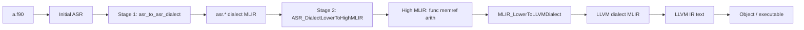

# LFortran `mlir-new` and ASR Dialect (`mlir4`)

This document describes the **mlir-new** backend work on branch `mlir4`, with emphasis on **why** the ASR dialect layer exists, **what** was implemented, and **how** to build and inspect output using the sample program [`a.f90`](../../a.f90).

---

## Quick start

From a built tree (see [Build](#build)), with the `mlir19` conda environment active:

```bash
export PATH="/path/to/3_lfortran/lfortran/src/bin:$PATH"
cd /path/to/lfortran_mlir   # directory containing a.f90

# Stage 1 only: ASR dialect MLIR (asr.* ops)
lfortran a.f90 --backend=mlir-new --show-mlir-asr-dialect

# Stage 2 output: high-level MLIR (func / memref / arith)
lfortran a.f90 --backend=mlir-new --show-mlir-high-dialect

# After LLVM-dialect lowering
lfortran a.f90 --backend=mlir-new --show-mlir-llvm-dialect

# Full compile through mlir-new → LLVM IR → object
lfortran a.f90 --backend=mlir-new
```

Set **`USE_MLIR_Upstream=1`** to route MLIR lowering and translation through upstream MLIR (see [Environment variables](#environment-variables)).

---

## Sample program: `a.f90`

[`a.f90`](../../a.f90) is a small Fortran program used in local testing:

```fortran
program print_01
  implicit none
  integer :: x, i
  do i = 1, 1000000000
    x = i + 5
  end do
  print *, x
  ! ... two more similar loops and prints ...
end program
```

It exercises **integer variables**, **do loops**, **assignments**, and **print**. That makes it a good *end-to-end* target for the two-stage `--backend=mlir-new` pipeline.

---

## Why this work exists

### Problem

The original **mlir-new** path lowered Initial ASR directly to high-level MLIR (`func`, `memref`, `arith`) inside a single large emitter. That approach:

- Hid ASR semantics inside ad hoc MLIR construction, making it hard to inspect or test intermediate representation.
- Could not scale to all of ASR (~238 node kinds) without an unmaintainable monolith.
- Blocked the stated refactor goal: replace the old MLIR backend with a **structured, stage-oriented** pipeline aligned with MLIR dialect design.

### Design A: one ASR constructor → one `asr.*` op

**Design A** maps every constructor in `ASR.asdl` to exactly one ASR dialect op (`asr.integer_constant`, `asr.do_loop`, …). **Why:**

- **Single source of truth** — schema, C API, visitor fragments, and lowering dispatch are generated from `ASR.asdl`, so the dialect surface stays complete when ASR evolves.
- **Inspectable stage** — developers can dump stage 1 with `--show-mlir-asr-dialect` and see one op per ASR node before any memref/arith lowering.
- **Incremental lowering** — handlers can be implemented op-by-op without rewriting the driver each time.

### Mandatory two-stage pipeline

Every **mlir-new** compilation now follows:

```
Fortran → Initial ASR
       → Stage 1: asr_to_asr_dialect     (ASR → asr.* ops)
       → Stage 2: ASR_DialectLowerToHighMLIR (asr.* → func/memref/arith)
       → MLIR_LowerToLLVMDialect         (high MLIR → LLVM dialect)
       → MLIR_TranslateModuleToLLVMIR    (LLVM dialect → .ll text)
       → parse .ll → host LLVM module    (existing object emission)
```

**Why mandatory:** If stage 1 could be skipped, the generated dialect and schema would be dead code and the architecture would drift back to a bypass. Routing `asr_to_mlir_new` through `asr_to_asr_dialect` keeps one entry point for all future mlir-new work.

### Native backend first, upstream ODS later

The native backend stores `asr.*` ops as **unregistered MLIR ops** tagged with `asr.op_kind` and `asr.f.*` field attributes. **Why:** Full upstream TableGen/ODS registration is a large follow-on; the native C API unblocks emitter, verify, print, and lowering work immediately. Upstream stubs delegate to native until real ODS lands.

---

## What changed (summary)

| Area | Key paths | Role |
|------|-----------|------|
| Generator | `src/libasr/asdl_to_asr_dialect.py` | ASDL → schema, API headers, ODS inc, visitor, lowering dispatch |
| Generated | `src/mlir/generated/*`, `src/libasr/codegen/generated/*` | Committed outputs; regenerate when `ASR.asdl` changes |
| C API | `src/mlir/lfortran/asr_dialect_api.{h,c}` | Stable boundary: create, verify, print, lower |
| Native runtime | `asr_dialect_api_native.c`, `asr_dialect_lowering_handlers.c` | Op storage + semantic lowering to high MLIR |
| Upstream stub | `asr_dialect_api_upstream.cpp` | `extern "C"` stubs → native (until ODS) |
| Stage 1 emitter | `src/libasr/codegen/asr_to_asr_dialect.{h,cpp}` | Initial ASR → `asr.*` via `ASR_DialectCreateOp` |
| Pipeline glue | `src/libasr/codegen/asr_to_mlir_new.cpp` | Thin wrapper: calls `asr_to_asr_dialect(Full)` |
| CLI / dumps | `src/bin/lfortran.cpp`, `lfortran_command_line_parser.*` | `--backend=mlir-new`, `--show-mlir-asr-dialect`, etc. |
| CMake | `src/mlir/CMakeLists.txt`, `src/libasr/CMakeLists.txt` | `generate_asr_dialect`, `lfortran_asr_dialect` library |

### Commit history on `mlir4` (newest first)

1. **fix(asr-dialect): resolve emitter and runtime compile/link errors** — CoreC string API, schema enum names, C++ `loc` shadowing, `extern "C"` on upstream stubs.
2. **fix(asr-dialect): make generator output and CMake build C/C++ compatible** — C-safe generated code, include paths, Python3 for codegen.
3. **Route mlir-new through mandatory ASR dialect two-stage pipeline** — Refactor driver; `--show-mlir-asr-dialect`.
4. **Add ASR-to-dialect converter (stage 1)** — `asr_to_asr_dialect.cpp` hand-written visitor for core forms.
5. **Implement native ASR dialect C API and CMake** — `lfortran_asr_dialect` target and lowering handlers.
6. **Add ASDL-driven ASR dialect generator (Design A, 238 ops)** — `asdl_to_asr_dialect.py` + generated artifacts.

Earlier commits on the same branch add the base **mlir-new** C API path, CLI flags, and CMake wiring for `certik/mlir`.

---

## Architecture diagram



**Inspection points:**

| Flag | Stops after | Output |
|------|-------------|--------|
| `--show-mlir-asr-dialect` | Stage 1 | `asr.*` ops in a `module` |
| `--show-mlir-high-dialect` / `--show-mlir` | Stage 2 (+ lower to inspect high form) | `func.func`, `memref`, `arith` |
| `--show-mlir-llvm-dialect` | LLVM dialect lowering | MLIR in LLVM dialect |
| `--show-llvm-from-mlir` | LLVM IR translation | `.ll` text |
| (default compile) | Full pipeline | Binary / object |

---

## Build

Activate the **mlir19** conda environment, then from `3_lfortran/lfortran`:

```bash
# Clean reconfigure (when CMake cache is stale)
rm -rf CMakeCache.txt CMakeFiles/
cmake . -GNinja -DWITH_LLVM=yes -DWITH_MLIR=yes -DCMAKE_PREFIX_PATH="$CONDA_PREFIX"
cmake --build .
```

Optional: initialize submodules if MLIR upstream is missing:

```bash
git submodule update --init --recursive
```

Add the built binary to `PATH`:

```bash
export PATH="$(pwd)/src/bin:$PATH"
```

Regenerate ASR dialect artifacts after editing `ASR.asdl` or the generator:

```bash
python3 src/libasr/asdl_to_asr_dialect.py \
  --asdl src/libasr/ASR.asdl \
  --out-mlir-dir src/mlir/generated \
  --out-lfortran-dir src/libasr/codegen/generated

# CI-style staleness check
python3 src/libasr/asdl_to_asr_dialect.py --check \
  --asdl src/libasr/ASR.asdl \
  --out-mlir-dir src/mlir/generated \
  --out-lfortran-dir src/libasr/codegen/generated
```

---

## Running commands with `a.f90`

Assume:

```bash
export PATH="/path/to/3_lfortran/lfortran/src/bin:$PATH"
cd /path/to/lfortran_mlir    # contains a.f90
```

### Backend

| Command | Behavior |
|---------|----------|
| `lfortran a.f90 --backend=mlir-new` | Full mlir-new pipeline → LLVM IR → object/executable |
| `lfortran a.f90 --backend=llvm` | Classic ASR→LLVM (not mlir-new) |
| `lfortran a.f90 --backend=mlir` | Legacy MLIR C++ builder (not mlir-new) |

### Debug / dump flags (mlir-new)

These flags **imply the mlir-new pipeline** even if `--backend` is omitted:

| Command | What you get |
|---------|----------------|
| `lfortran a.f90 --show-mlir-asr-dialect` | Stage 1 ASR dialect text (`MLIRModule::mlir_asr_dialect_text`) |
| `lfortran a.f90 --show-mlir-high-dialect` | High-level MLIR after stage 2 |
| `lfortran a.f90 --show-mlir` | Same high-level MLIR as above for mlir-new |
| `lfortran a.f90 --show-mlir-llvm-dialect` | MLIR after `MLIR_LowerToLLVMDialect` |
| `lfortran a.f90 --show-llvm-from-mlir` | LLVM IR string from the MLIR translation path |
| `lfortran a.f90 --show-asr` | Initial ASR (before any MLIR); useful to compare with stage 1 |

Combine with explicit backend:

```bash
lfortran a.f90 --backend=mlir-new --show-mlir-asr-dialect
```

### Environment variables

| Variable | Value | Effect |
|----------|-------|--------|
| `USE_MLIR_Upstream` | `1` | Use upstream MLIR for **LLVM dialect lowering** and **LLVM IR / wasm translation** (`mlir_api_impl_upstream.cpp`). ASR dialect upstream stubs still delegate to native. |
| `USE_MLIR_Upstream` | unset or `0` | Native C lowering in `mlir_lower_to_llvm.c` and related translators. |

Example:

```bash
export USE_MLIR_Upstream=1
lfortran a.f90 --backend=mlir-new --show-mlir-llvm-dialect

export USE_MLIR_Upstream=0
lfortran a.f90 --backend=mlir-new --show-mlir-high-dialect
```

Only the exact string **`1`** selects upstream; any other value uses native.

### Typical debugging workflow

1. **Confirm ASR** — `lfortran a.f90 --show-asr`
2. **Inspect dialect emission** — `lfortran a.f90 --show-mlir-asr-dialect`
3. **Inspect semantic lowering** — `lfortran a.f90 --show-mlir-high-dialect`
4. **Inspect LLVM path** — `lfortran a.f90 --show-mlir-llvm-dialect` then `--show-llvm-from-mlir`
5. **Full compile** — `lfortran a.f90 --backend=mlir-new -o a`

---

## Current limitations

Understanding these avoids confusion when testing with `a.f90`:

| Feature | Stage 1 emitter | Stage 2 lowering |
|---------|-----------------|------------------|
| `integer` constants, `+` binops | Supported | Supported |
| Scalar `variable` / `var` / `assignment` | Supported | Supported |
| `print` | Supported | Supported |
| `return` / program skeleton | Supported | Supported |
| **`do` loops** (`DoLoop`) | Hand-written visitor | CF lowering (`cf.br` / `cf.cond_br`) |
| **`if` / `error stop`** | Hand-written visitor | CF + early `func.return(1)` on error stop |
| **Integer compare** (`/=`, etc.) | Hand-written visitor | `arith.cmpi` |
| Real, arrays, intrinsics | Not yet | Stubs |

Stage 1 verification is **best-effort** (missing optional schema fields may warn but continue during bring-up). Loop bodies are currently limited to **one statement** per `body`/`orelse` sequence (nested `do`/`if`/`error stop` are fine).

---

## How the pieces help long-term

1. **Generator** — Adding an ASR node updates all artifacts in one command; no manual drift across 238 ops.
2. **Stage 1 dump** — Regression tests can golden `--show-mlir-asr-dialect` independent of MLIR lowering quality.
3. **Stage 2 handlers** — Each `ASR_Lower*` function is a focused unit of work; dispatch is generated.
4. **Single driver path** — `asr_to_mlir_new` cannot silently bypass the dialect again.
5. **Native/upstream split** — Production can stay on native while ODS registration matures behind the same C API.

---

## Related documentation

- Repo root: `mlir_build.txt` — local build and example commands for `a.f90`
- `ASR_Dialect.md` / `ASR_Dialect_2.md` — design notes
- `.claude/memory/mlir_new_implementation.md` — mlir-new handoff (update if CLI behavior changes)

---

## File map (ASR dialect)

```
src/libasr/
  ASR.asdl                          # Source of truth
  asdl_to_asr_dialect.py            # Generator
  codegen/
    asr_to_asr_dialect.{h,cpp}      # Stage 1 visitor
    asr_to_mlir_new.cpp               # Pipeline entry (delegates to stage 1+2)
    generated/asr_to_asr_dialect_visitor.inc

src/mlir/
  generated/                        # schema, dispatch, ops.td.inc, …
  lfortran/
    asr_dialect_api.{h,c}           # Public C API + dispatch
    asr_dialect_api_native.c        # Create / verify / print
    asr_dialect_lowering_handlers.c # Stage 2 lowering
    asr_dialect_api_upstream.cpp    # Upstream stub (extern "C")
```

---

*Branch: `mlir4` · Sample: [`../../a.f90`](../../a.f90)*
